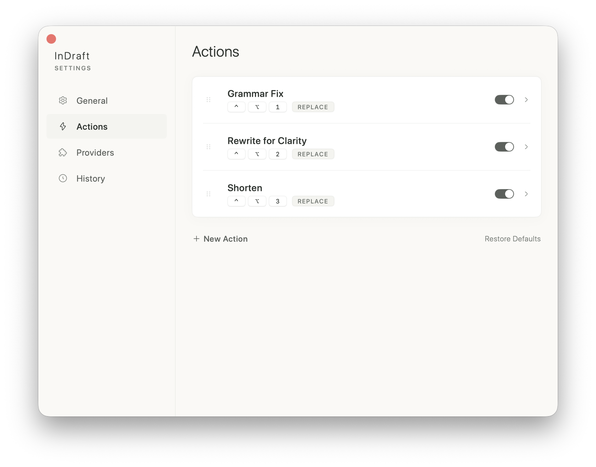
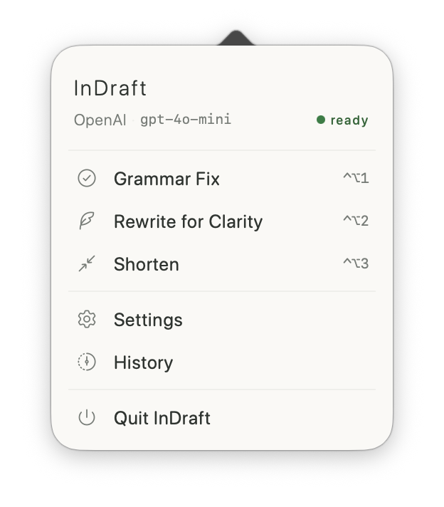
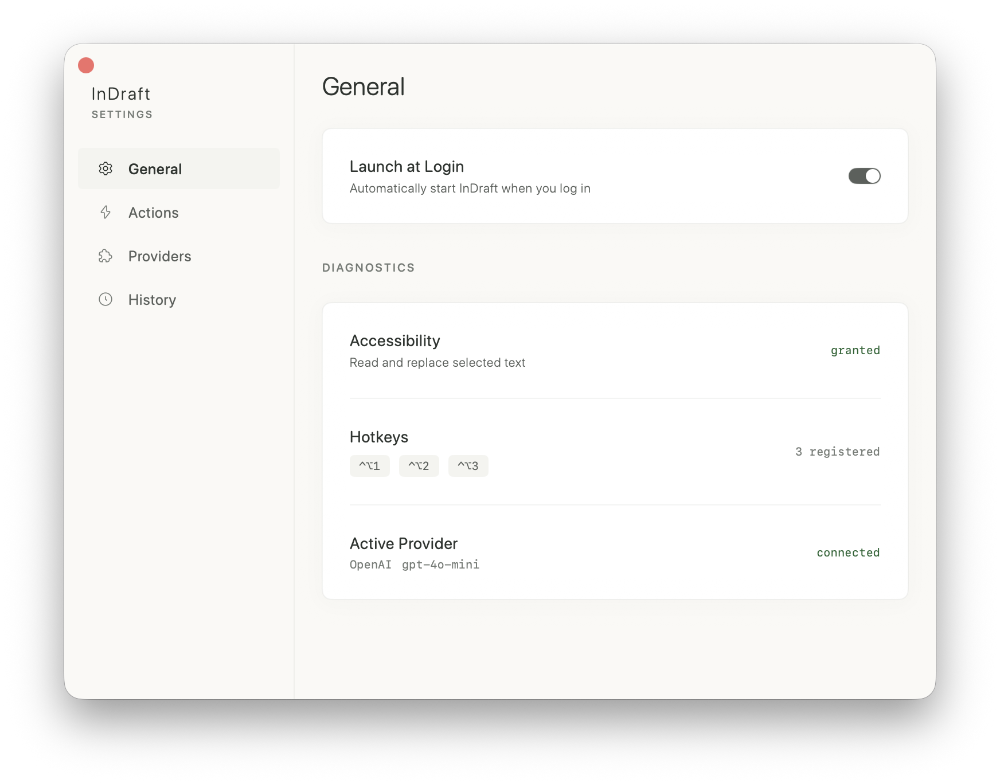

<p align="center">
  
</p>

<h1 align="center">InDraft</h1>

<p align="center">
  <strong>Transform any text, anywhere on your Mac — without leaving what you're doing.</strong>
</p>

<p align="center">
  <a href="https://github.com/addison-w/InDraft/releases/latest">📥 Download</a> · macOS 14.0+ · v0.1.0
</p>

---

InDraft lives in your menu bar and rewrites, fixes, shortens, or translates your text in-place with a single keystroke. No copy-paste gymnastics. No switching to a browser. No waiting on a ChatGPT tab.

<p align="center">
  
</p>

---

## 😩 The Problem

You're writing an email. You select a paragraph, open a new tab, paste it into ChatGPT, type "fix the grammar", wait, copy the result, switch back, paste it over the original text.

That's **~30 seconds** for one fix.

Now multiply that by **50–100 times a day** — drafting emails, writing docs, polishing Slack messages, editing proposals. That's **25–50 minutes a day** lost to app-switching and copy-pasting. Every. Single. Day.

And if you're chatting in multiple languages? Even worse. Type in your native language, switch to a translator, copy-paste, switch back… for every single message.

## ✨ The Solution

With InDraft:

1. **Select** text in any app
2. **Press a hotkey** (e.g. `⌃⌥1`)
3. **Done** — text is transformed in place

That's it. No context switching. No clipboard juggling. Your cursor stays right where it is.

---

## 🚀 What Can It Do?

InDraft ships with three built-in actions, and you can create as many custom ones as you want:

| Hotkey | Action | What It Does |
|--------|--------|-------------|
| `⌃⌥1` | **Grammar Fix** | Fixes spelling, grammar, and punctuation |
| `⌃⌥2` | **Rewrite for Clarity** | Simplifies and removes ambiguity |
| `⌃⌥3` | **Shorten** | Cuts the fluff, keeps the meaning |

<p align="center">
  
</p>

### 🌍 Instant Translation

Create a custom action with a prompt like:

> *"Translate to Japanese. Output only the translation."*

Now you can type in English, select it, hit your hotkey, and the text transforms into Japanese **right where you typed it**. Perfect for multilingual chats, emails, or any conversation where you think in one language but need to write in another.

### 🛠️ Custom Actions

Build any text transform you can describe in a prompt:

- **Make it formal** — for client-facing emails
- **Translate to Spanish** — for bilingual workflows
- **ELI5** — simplify technical jargon
- **Expand** — flesh out bullet points into full paragraphs
- **Code review tone** — rewrite feedback to be constructive

Each action gets its own hotkey. Your text, your rules.

---

## 📦 Install

1. Download `InDraft-v0.1.0.dmg` from [Releases](https://github.com/addison-w/InDraft/releases/latest)
2. Open the DMG and drag **InDraft** to Applications
3. Launch InDraft — the onboarding will walk you through setup

### Requirements

- macOS 14.0+
- An OpenAI-compatible API provider (OpenAI, Ollama, any compatible endpoint)

---

## 🎯 How It Works

```
┌─────────────────────────────────────────────────┐
│                                                 │
│   You're writing in any app                     │
│                                                 │
│   1. Select some text                           │
│   2. Hit ⌃⌥1 (or any action hotkey)            │
│                                                 │
│   ┌───────────────────────────────────┐         │
│   │  InDraft (in the background)      │         │
│   │                                   │         │
│   │  📋 Captures selected text        │         │
│   │  🤖 Sends to your AI provider    │         │
│   │  ✅ Replaces text in place        │         │
│   └───────────────────────────────────┘         │
│                                                 │
│   3. Keep working — text is already updated     │
│                                                 │
└─────────────────────────────────────────────────┘
```

InDraft reads your selected text via the macOS Accessibility API (with a clipboard fallback), sends it to your configured AI provider, and writes the result back — all in one fluid motion.

---

## ⚙️ Features

<p align="center">
  
  &nbsp;&nbsp;&nbsp;&nbsp;
  
</p>

- **🖥️ Menu bar app** — always running, never in the way
- **⌨️ Global hotkeys** — trigger actions from any app with customizable shortcuts
- **🔌 Multi-provider** — OpenAI, Ollama, or any OpenAI-compatible API
- **👀 Live preview** — optionally preview transforms before accepting
- **📋 Clipboard mode** — copy results instead of replacing
- **📜 History** — browse past transforms with configurable retention
- **🔐 Keychain storage** — API keys stored securely in macOS Keychain
- **🎨 Minimal design** — warm, editorial UI that feels native to macOS

---

## 🧑‍💻 Development

Built with SwiftUI + SwiftData. Uses [XcodeGen](https://github.com/yonaskolb/XcodeGen) for project generation.

```bash
# Generate Xcode project
xcodegen generate

# Open in Xcode
open InDraft.xcodeproj
```

---

## 📄 License

MIT
